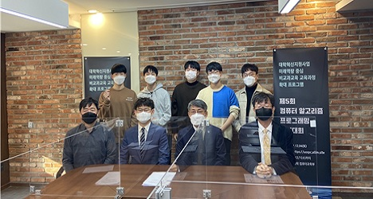
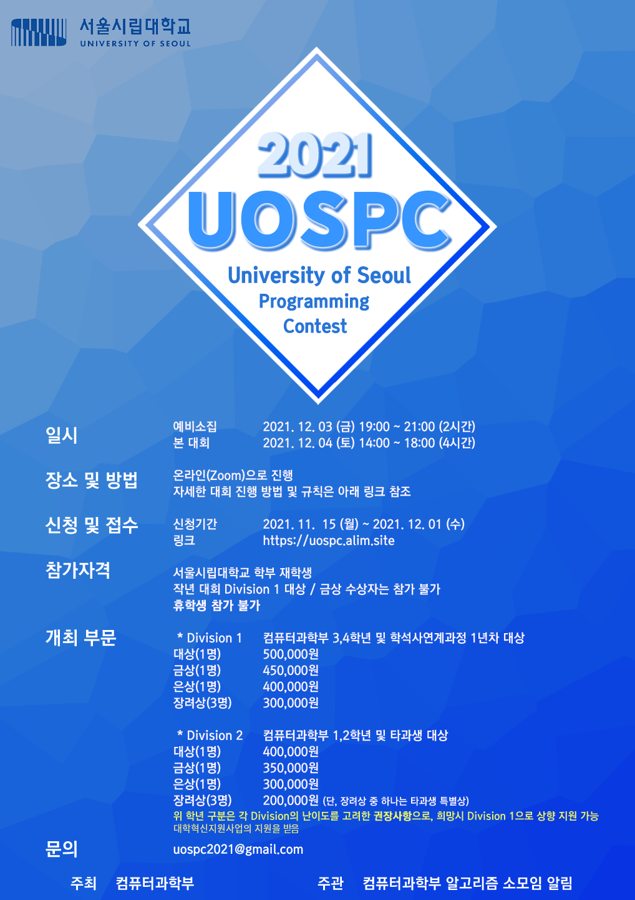

# 서울시립대학교 알고리즘 경진대회 2021 (University of Seoul Programming Contest)

2021년 12월 4일 온라인으로 개최된 서울시립대학교 알고리즘 경진대회(UOSPC)의 지문, 테스트케이스, 대회 기록을 저장한 리포지토리입니다.

UOSPC는 서울시립대학교 학생들의 PS(Problem Solving)능력 증진, ICPC, 코딩테스트 등을 대비하기 위하여 2017년부터 개최된 프로그래밍 경진대회입니다. 한정된 시간동안 주어진 문제를 해결하는 것이 목표입니다.

## 대회 기록

문제 풀이 및 대회 후기는 [editorial](/editorial), 실제 스코어보드는 [scoreboards](/scoreboards) 디렉토리에서 확인하실 수 있습니다.

* [문제 풀이](/editorial/UOSPC%202021%20후기%20및%20시상.pdf)
* [Division 1 스코어보드](/scoreboards/div1-scoreboard.png)
* [Division 2 스코어보드](/scoreboards/div2-scoreboard.png)

## 시상식

UOSPC 2021은 COVID19의 여파를 고려하여 온라인으로 진행되었고, [12월 28일 서순탁 총장님과 대면 시상식을 진행하였습니다.](https://www.uos.ac.kr/korColumn/view.do?list_id=about02&seq=242&sort=1&menuid=2000001009005000000)

### 수상자 명단

* Division 1
  1. 대상: **유시온** 님
  2. 금상: **전예준** 님
  3. 은상: **한상일** 님
  4. 장려상(3인)
    * **이관희** 님
    * **김나연** 님
    * **김지산** 님
* Division 2
  1. 대상: **이명규** 님
  2. 금상: **박성우** 님
  3. 은상: **김민호** 님
  4. 장려상(3인)
    * **김동현** 님
    * **김형철** 님
    * **장호빈** 님

## 대회 포스터

포스터는 정상윤 님께서 제작해주셨습니다.

## 도움을 주신 분들

* 김정현 ([@powergee](https://github.com/powergee)): 문제 출제 및 검수, 서버 관리
* 오규민 ([@mulmuri](https://github.com/mulmuri)): 문제 출제 및 검수
* 이현석 ([@travelbeeee](https://github.com/travelbeeee)): 문제 출제 및 검수
* 정상윤 ([@Bingha-Jeong](https://github.com/Bingha-Jeong)): 문제 출제 및 검수
* 최문기 ([@iknoom](https://github.com/iknoom)): 문제 출제 및 검수
* 최연웅 ([@yonsweng](https://github.com/yonsweng)): 문제 검수
* 정인우 ([@pasly0920](https://github.com/pasly0920)): 문제 검수
* 주현도: 문제 검수
* 김민호 교수님 ([서울시립대학교 컴퓨터과학부 교수](http://www.minho-kim.com/)): 대회 운영 및 검수

## 문제 목록

대회는 Division 1과 Division 2로 나누어 진행되었고, 각 Division에 9문제씩 출제되었습니다.

* Division 1: 컴퓨터과학부 3, 4학년 및 학석사연계과정 1년차 대상
* Division 2: 컴퓨터과학부 1, 2학년 및 타과생 대상

### Division 1

|   |         Title         |        ID        |    문제 아이디어 제공     |
|---|:---------------------:|:----------------:|:------------------------:|
| A | 전구 끄기 - EASY      | bulb-easy        | 오규민                    |
| B | 브로드캐스트 네트워크 | broadcast-small  | 김정현                     |
| C | 조공을 보내줘         | givememoney      | 이현석                    |
| D | 괄호 뒤집기           | parentheses-flip | 정상윤                    |
| E | 메이데이              | mayday           | 오규민                    |
| F | 경찰과 도둑           | police-theif     | 정상윤                    |
| G | 전구 끄기 - HARD      | bulb-hard        | 오규민                    |
| H | 모빌                  | mobile           | 오규민                    |
| I | 스택과 큐             | stack-queue      | 오규민                    |

### Division 2

|   |          Title          |        ID        |    문제 아이디어 제공     |
|---|:-----------------------:|:----------------:|:------------------------:|
| A | 헬린이를 구해줘         | workout          | 이현석                    |
| B | 중도지키미              | library          | 이현석                    |
| C | 전구 끄기 - EASY        | bulb-easy        | 오규민                    |
| D | 브로드캐스트 네트워크   | broadcast-small  | 김정현                     |
| E | 괄호 뒤집기             | parentheses-flip | 정상윤                    |
| F | 동아리 홍보제           | teamfestival     | 이현석                    |
| G | 메이데이                | mayday           | 오규민                    |
| H | UOSPC를 가지고 놀아보자 | str-queue        | 김정현                     |
| I | 전구 끄기 - HARD        | bulb-hard        | 오규민                    |