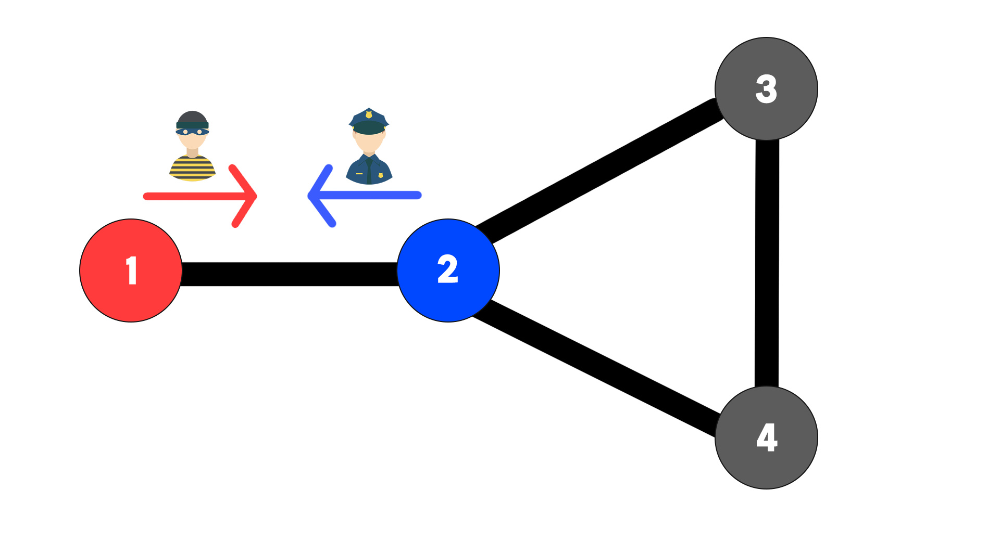
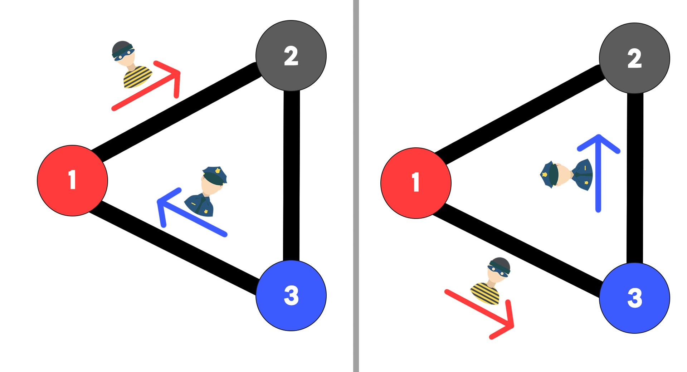

# 경찰과 도둑(가제)

## 문제

경찰 $A$는 도둑 $B$를 추격하여 잡으려고 한다.

이들이 살고 있는 나라는 $N$개의 도시와, $N$개의 양방향 도로로 이루어져 있다. **단, 임의의 두 도시 사이에는 반드시 경로가 존재하며, 두 도시 사이를 잇는 도로는 최대 1개이다**.

경찰은 $P$번 도시에서, 도둑은 $Q$번 도시에서 각각 출발하여 동시에 움직인다. 이들은 매 초마다 인접한 도시로 이동할 수 있으며, 인접한 도시로 이동하는 데는 $1$초의 시간이 소요된다.

도둑 $B$는 경찰의 생각을 속속들이 읽을 수 있기에, 매 이동마다 경찰 $A$가 어디로 움직일지 예측할 수 있다. 또한 도둑 $B$는 똑똑해서, 매번 최적의 루트로 도주한다!

도둑과 경찰의 움직임을 정리하면 다음과 같다.

1. 경찰 $A$가 어디로 움직일지 결정한다.
2. 도둑 $B$는 경찰 $A$가 어디로 움직일지 예측한다.
3. 경찰 $A$와 도둑 $B$가 동시에 인접 도시로 움직인다.

이 1~3의 과정을 무한히 반복하였을 때, 경찰 $A$는 도둑 $B$를 잡을 수 있을까? 경찰 $A$와 도둑 $B$가 **같은 도로 또는 같은 도시 위에 있을 때** 경찰 $A$는 도둑 $B$를 잡을 수 있다.

잡지 못하는 도둑을 평생 추적하는 것은 공권력의 심각한 손실이 아닐 수 없다. 여러분의 프로그래밍 실력으로 공권력의 낭비를 막아보자!


## 입력

첫째 줄에는 도시와 도로의 개수 $N$이 주어진다.(3 \leq N \leq 3000)

둘째 줄부터 $N$줄에 걸쳐 도시 $u$와 $v$가 공백으로 구분되어 주어진다.$(1 \leq u \leq N, 1 \leq v \leq N,  u \neq v )$ 

이는 도시 $U$와 $V$가 도로로 연결되어 있음을 의미한다.

마지막 $N+2$번째 줄에는 도시 $P$와 $Q$가 공백으로 구분되어 주어진다. $(1 \leq P \leq N, 1 \leq Q \leq N,  P \neq Q )$


## 출력
경찰 $A$가 도둑 $B$를 결국 잡을 수 있다면 $YES$를, 잡을 수 없다면 $NO$를 출력하라.

## 예제 입력 1
```
4
1 2
2 3
3 4
4 2
2 1
```
<div style="text-align:center"></div>

도둑 $B$는 $1$에서 $2$로 움직일 수밖에 없기 때문에, $1$과 $2$ 사이를 잇는 도로에서 검거된다!

## 예제 출력 1
```
YES
```

## 예제 입력 2
```
3
1 2
2 3
1 3
3 1
```
<div style="text-align:center"></div>

경찰은 영원히 도둑을 잡을 수 없다!

## 예제 출력 2
```
NO
```
