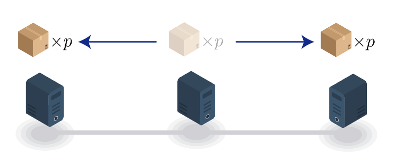

# 브로드캐스트 네트워크

## 문제

컴퓨터통신 과목을 듣고 네트워크 이론에 관심을 가지게 된 정현이는 $1$번 컴퓨터부터 $V$번 컴퓨터까지 총 $V$개의 컴퓨터를 $E$개의 링크로 연결하여 자신만의 네트워크를 만들었다. 그리고 각 컴퓨터에 모두 같은 프로그램을 설치해두었는데, 해당 프로그램은 1초마다 아래 동작을 무한히 반복한다.

* 현재 컴퓨터에 존재하는 패킷이 $p$개이고, $n$개의 다른 컴퓨터와 링크로 연결되어있다면, 연결된 $n$개의 컴퓨터 각각에 $p$개의 패킷을 복사하여 전송한다.
    * 전송이 끝나면 원래 존재하던 $p$개의 패킷은 이 컴퓨터에서 삭제된다.
    * 패킷을 복사하는데 시간은 들지 않으며, $t$초에 전송한 패킷은 패킷의 양에 관계없이 정확히 $t+1$초에 목적지에 도착한다.

<div style="text-align:center;"></div>

정현이는 가장 처음($0$초) $1$번 컴퓨터에 $1$개의 패킷만 생성해두었다. $0$초부터 위에서 설명한 프로그램이 실행된다고 할 때, 정확히 $T$초인 시점에 네트워크 전체에 존재하는 패킷의 수는 몇개일까? 이를 계산하는 프로그램을 작성하시오. (단, 정답이 매우 커질 수 있으므로 정답을 $10^9+7$로 나눈 나머지를 출력한다.)

## 입력

첫째 줄에는 컴퓨터의 개수 $V$, 링크의 개수 $E$, 전체 패킷의 수를 구하고자 하는 시간 $T$가 공백으로 구분되어 주어진다. $(2 \leq V \leq 10, 1 \leq E \leq \frac{V \times (V-1)}{2}, 1 \leq T \leq 10^4)$

둘째 줄부터 총 $E$개 줄에 걸쳐, 각 링크가 연결하는 두 컴퓨터의 번호가 주어진다.

$i+1$ $(1 \leq i \leq E)$ 번째 줄의 두 개의 정수 $u$, $v$는 $i$번째 링크가 $u$번 컴퓨터와 $v$번 컴퓨터를 연결함을 의미한다.$(1 \leq u, v \leq V, u \neq v)$

한 쌍의 컴퓨터를 연결하는 링크가 두 개 이상 존재하는 경우는 없으며, $1$번 컴퓨터는 적어도 하나 이상의 다른 컴퓨터와 연결되어 있음이 보장된다.

## 출력

첫째 줄에 $T$초인 시점에 네트워크 전체에 존재하는 패킷의 수를 $10^9+7$로 나눈 나머지를 출력한다.

## 예제 입력 1

```
5 6 2
1 2
1 3
2 4
2 5
3 4
4 5
```

## 예제 출력 1

```
5
```

위 상황을 그림으로 나타내면 아래와 같다.

<div style="text-align:center;"></div>