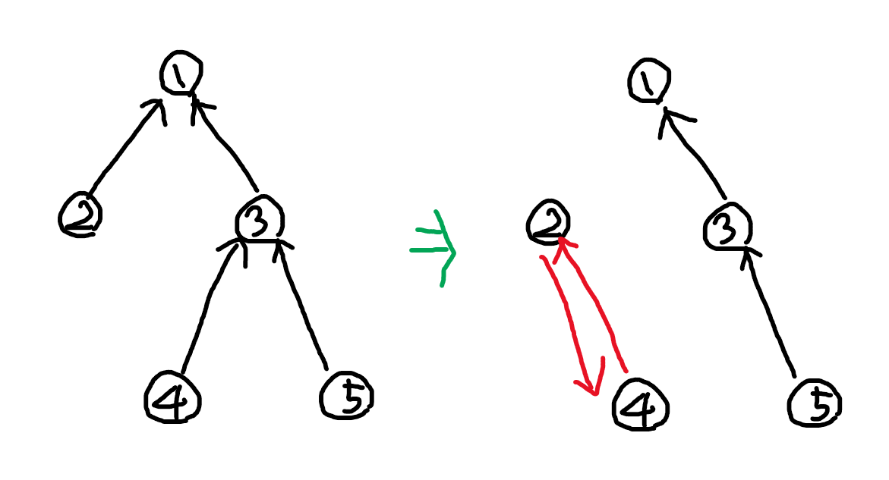
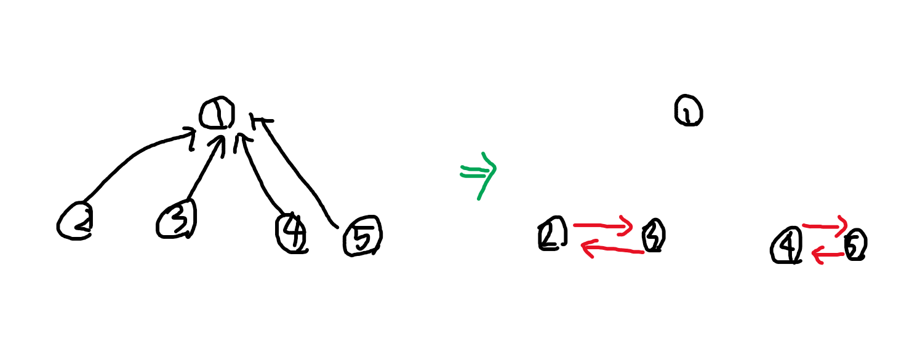
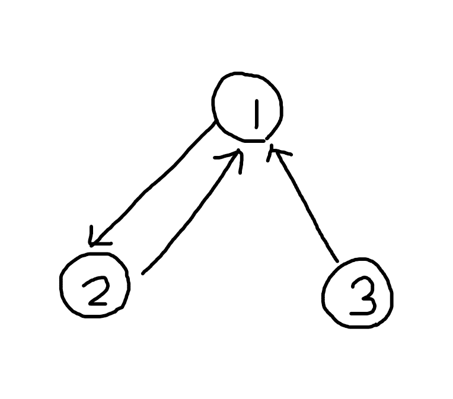

# 삼각관계

출제자: 최문기

시간제한: ?

메모리제한: ?

## 문제

어떤 사람을 좋아하는 사람이 두 명이면 이 세 사람은 삼각관계에 놓여있다고 한다.

큐피드의 화살을 써서 두 사람을 서로 좋아하는 사이로 만들 수 있다.

최소한의 큐피드의 화살을 써서 삼각관계를 모두 없애보자.

## 입력

첫번째 줄에는 2 <= V <= (미정)

두번째 줄에는 각 사람이 좋아하는 사람(1<= i <= V), 좋아하는 사람이 없으면 -1

## 출력

삼각관계를 없애기 위해 써야하는 큐피드의 화살의 최소 개수를 출력한다.

불가능하면 -1을 출력한다.

## 예제 입력 1

```
5
-1 1 1 3 3
```

## 예제 출력 1

```
1
```



## 예제 입력 2

```
5
-1 1 1 1 1
```

## 예제 출력 2

```
2
```



## 예제 입력 3

```
3
2 1 1
```

## 예제 출력 3

```
-1
```

