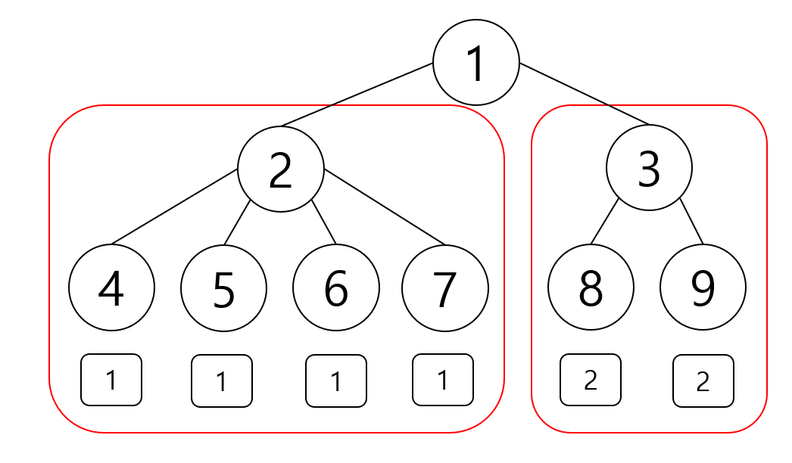

# 모빌

## 문제

당신에게는 모빌이 하나 있다. 모빌이란 가느다란 실, 철사 등으로 여러 가지 모양의 쇳조각이나 나뭇조각을 매달아 미묘한 균형을 이루게 한 움직이는 조각을 말한다. 이 모빌에게는 특별한 성질이 있다. 문제에서 모빌은 아래와 같은 성질을 가진다.

* 모빌의 구조는 트리와 같다.
* 모빌의 중심이자 루트 노드는 $1$번이다.
* 모빌의 리프 노드들에는 각각 자연수에 해당하는 무게를 가진 장식물을 달 수 있다.
* 모빌물의 리프 노드가 아닌 모든 정점에 대해, 정점과 연결된 서브트리들의 무게가 모두 같을 때 모빌은 균형을 이룬다. 이때 서브 트리의 무게는 서브 트리에 해당하는 부분에 달린 장식물의 무게 합과 같다.

모빌의 균형 상태에 대한 예시는 아래 그림에 잘 나와있다. 트리의 리프에 달린 장식물의 무게가 각각 $1, 1, 1, 1, 2, 2$ 이면 1번 기준으로 붉은 색 상자로 구분된 서브트리에 포함된 모든 장식물의 무게의 합은 $4$로 동일하다. 이때 모빌은 균형을 이루며, 모빌의 총 무게는 $8$이다.

<div style="text-align:center"></div>

당신은 모든 모빌의 리프 노드에 장식물을 매달되, 모빌이 균형을 이루도록 장식물의 무게는 자연수 중 임의로 정할 수 있다. 이 과정에서 할 수 있는 한 모빌의 무게를 최소화시키려고 한다. 이때 가능한 모빌의 무게의 최소값을 구하는 프로그램을 작성하시오.

## 입력

첫째 줄에는 트리를 구성하는 정점의 수 $N$이 주어진다. $(2 \leq N \leq 100)$

둘째 줄부터 $N-1$개의 줄에 걸쳐 두 정점 $u, v$가 공백으로 구분되어 주어진다. $(1 \leq u, v \leq N, u \leq v)$ 이는 정점 $u$가 정점 $v$의 부모 노드로 서로 연결되어 있음을 의미한다.

## 출력

모빌의 무게가 최소가 되도록 각각 장식물의 무게를 구성했을 때 모빌의 무게를 출력하시오.

## 예제 입력 1

```
9
1 2
1 3
2 4
2 5
2 6
2 7
3 8
3 9
```

## 예제 출력 1

```
8
```

## 예제 입력 2

```
15
1 2
2 3
2 6
6 8
6 9
6 14
3 4
3 5
2 13
13 7
13 10
13 11
13 12
1 15
```

## 예제 출력 2

```
72
```
