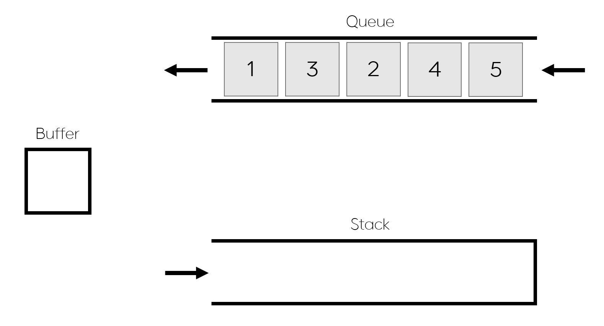

# 스택과 큐(초안)

## 문제

<div style="text-align:center;"></div>

정수를 담을 수 있는 [스택(Stack)](https://en.wikipedia.org/wiki/Stack_(abstract_data_type))과 [큐(Queue)](https://en.wikipedia.org/wiki/Queue_(abstract_data_type)), 그리고 버퍼(Buffer)가 있다. 버퍼에는 하나의 정수만 담을 수 있다.

그리고 아래와 같이 4가지 연산이 가능하다. 아래 연산은 모두 한 번으로 친다.

- Queue-pop: 큐에서 정수 하나를 빼서 버퍼에 넣는다.
- Queue-push: 버퍼에 있는 정수를 큐에 넣는다.
- Stack-pop: 스택에서 정수 하나를 빼서 버퍼에 넣는다.
- Stack-push: 버퍼에 있는 정수를 스택에 넣는다.

초기에 큐에는 $N$개의 정수가 채워져있다. 위 연산을 최소한으로 사용해서 큐에 있는 모든 정수를 스택에 오름차순으로 넣으려고 한다. 이 때 연산 횟수를 구해보자.

## 입력

첫째 줄에 초기에 큐에 들어 있는 정수의 개수 $N$이 주어진다. $(1 \leq N \leq 10^6)$

둘째 줄에 초기에 큐에 들어 있는 $N$개의 정수가 공백으로 구분되어 주어진다. 이 때 가장 왼쪽의 있는 정수가 큐의 front에 있다. 각 정수의 절댓값은 $10^9$보다 작거나 같다. 

## 출력

큐에 있는 원소들을 오름차순으로 스택에 넣기 위한 최소 연산 횟수를 출력한다. 최소 연산 횟수가 int 범위를 초과할 수 있음에 유의하자.

## 예제 입력 1

```
5
1 3 2 4 5
```

## 예제 출력 1

```
16
```

## 예제 입력 2

```
5
1 2 3 4 5
```

## 예제 출력 2

```
10
```

