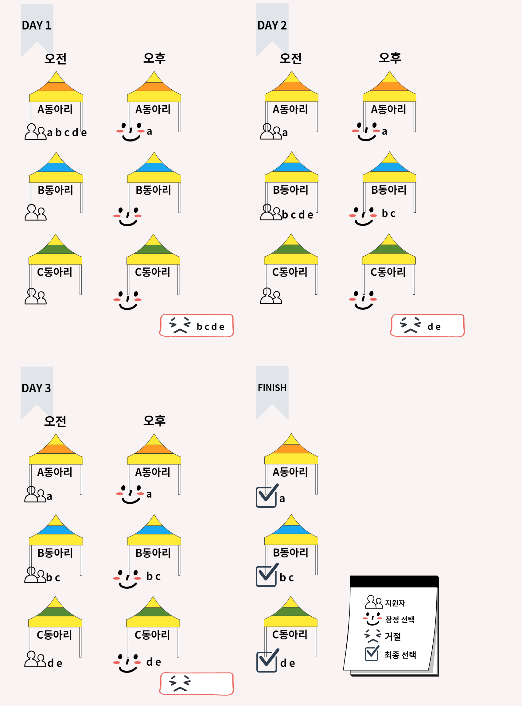

# 동아리 홍보제

## 문제

 시립대학교 동아리 홍보제 기간이 돌아왔다. 올해도 많은 동아리들이 홍보제 기간 동안 부스를 운영할 예정이다. $T$일동안 $M$개의 동아리와 동아리에 가입하고 싶은 $N$명의 학생들이 동아리 홍보제에 참가한다. 각 학생마다 선호하는 동아리가 있고, 마찬가지로 동아리도 선호하는 지원자들이 있다. 이 정보를 이용해서 각 동아리와 학생들을 매칭하려고 한다. 동아리 홍보제를 운영하는 학생회장을 도와 홍보제 기간이 끝나고 각 동아리 별로 선발한 신입 부원 명단을 만들어주는 프로그램을 작성하시오.

 다음 과정을 따라 $T$일동안 지원자와 동아리를 매칭하려고 한다.

- 오전에 각 지원자는 동아리에 지원한다.
   - 지원자들은 한 번에 한 곳의 동아리에만 지원할 수 있다.
   - 선호도가 높은 동아리부터 지원한다.
   - 지원하고 싶은 모든 동아리에서 거절당했다면, 슬프지만 지원을 중단한다.
   - 이전에 지원한 동아리에서 잠정 선택된 상태라면 추가 지원하지 않는다.
- 오후에 각 동아리는 지원한 지원자를 선택 혹은 거절한다.
   - 지원자의 수가 예정된 신입 동아리원 수보다 적거나 같다면 모든 지원자를 '잠정 선택' 한다.
   - 지원자의 수가 예정된 신입 동아리원 수보다 크다면 선호도가 낮은 지원자부터 '거절'한다. 이때, 신입 동아리원 수를 초과하는 지원자의 수만큼 '거절'한다.
   - 동아리 홍보제 마지막 날에 '잠정 선택' 되어 있는 지원자들은 신입 부원으로 선발된다.

## 입력

 첫째 줄에 동아리 홍보제를 운영하는 기간$(1 \leq T \leq 10)$, 동아리 수$(1 \leq M \leq 26)$, 지원자 수$(1 \leq N \leq 26)$이 주어진다. 동아리 명은 알파벳 대문자 (A ~ Z), 지원자 명은 알파벳 소문자(a ~ z)로 주어진다.

 둘째 줄부터 $M$줄에 걸쳐 동아리 명, 최대 신입 동아리원 수, $N$명의 지원자 이름이 선호하는 순서대로 주어진다. 동아리는 어떤 지원자가 지원할 예정인지 모르기 때문에 모든 지원자에 대해 선호도를 매기고 있다. 신입 동아리원은 $1$명 이상 $N$명 이하의 숫자가 주어진다.

 이후 $N$줄에 걸쳐 지원자 명과 지원하고 싶은 동아리 수, 동아리 명이 순서대로 주어진다. 지원자는 모든 동아리에 지원하지 않아도 되므로 입력으로 들어오는 동아리 명은 $1$개 이상 $M$개 이하다.

## 출력

 $M$개의 줄에 동아리 이름과 선별한 지원자 이름을 공백으로 구분해서 출력한다. 이때, 동아리 명이 사전 순으로 앞에 오는 동아리부터 출력하고 지원자 이름은 선호도가 높은 지원자부터 출력한다.

## 예제1

```
3 3 5
A 1 a b c d e
B 2 b c d e a
C 2 c d e a b
a 1 A
b 2 A B
c 3 A B C
d 3 A B C
e 3 A B C
```

## 출력1

```
A a
B b c
C d e
```



## 예제2

```
3 3 5
A 1 a b c d e
B 2 c b d e a
C 1 c d e a b
a 1 A
b 2 B A
c 2 B A
d 1 B
e 1 A
```

## 출력2

```
A a
B c b
C
```

